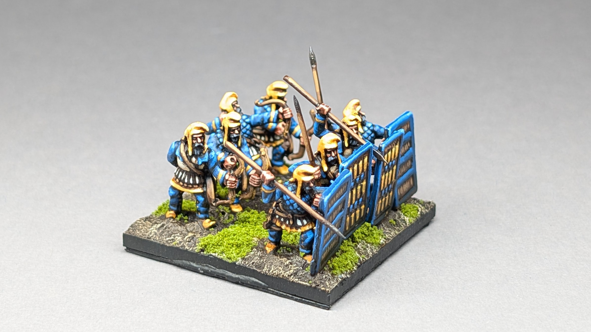
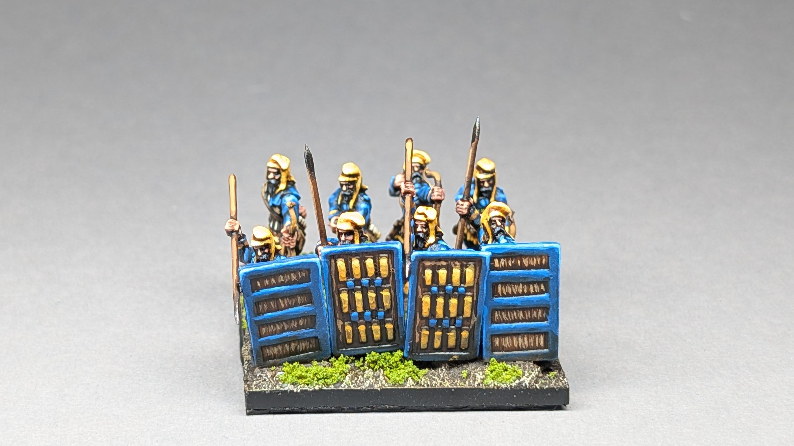
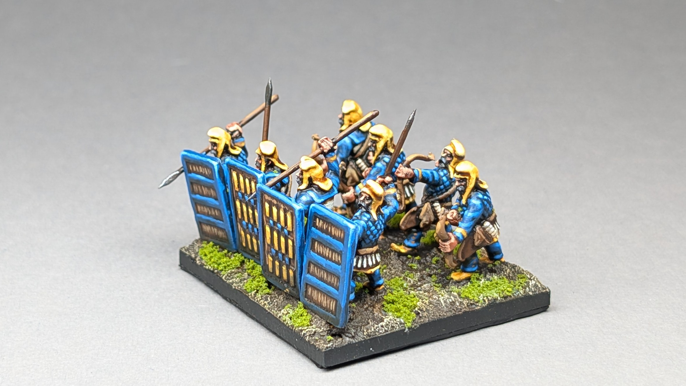
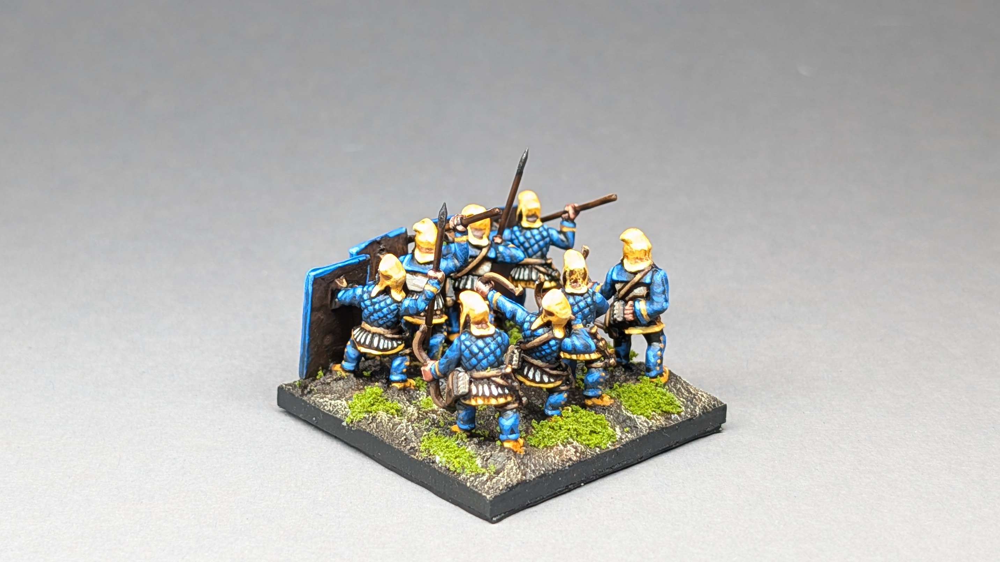
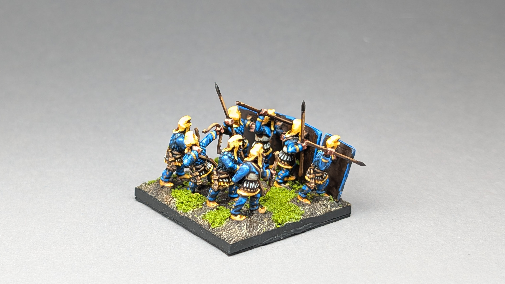
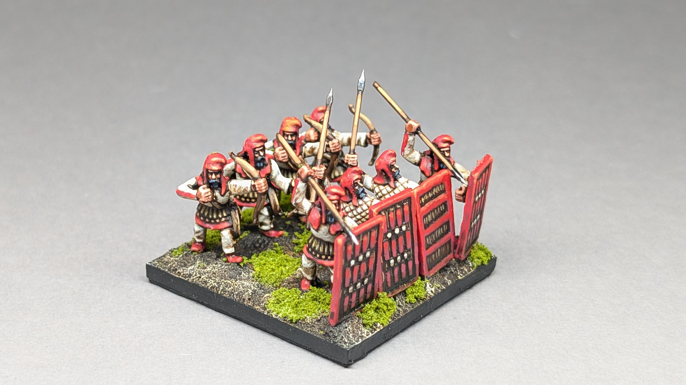
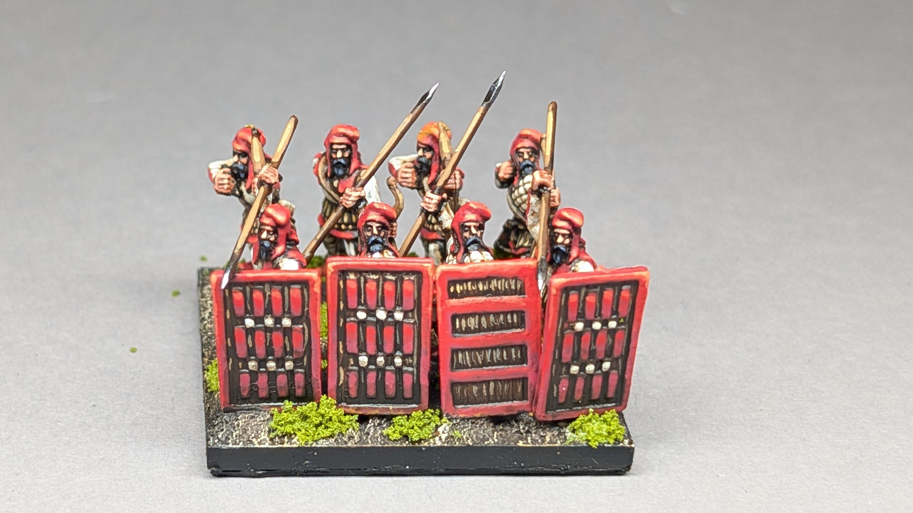
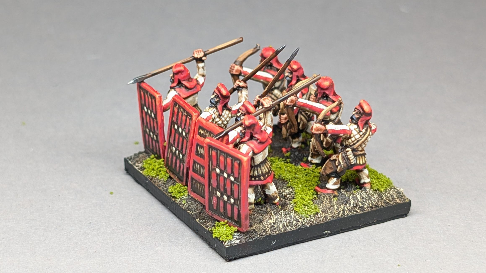
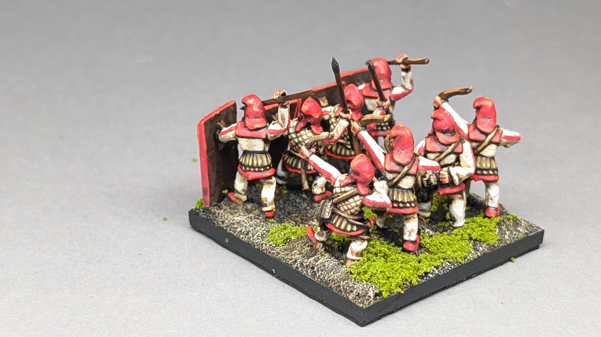
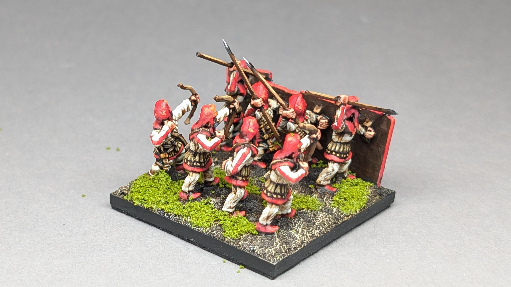

The Sparabara formed the front ranks of the early Achaemenid Persian army — shield-bearers carrying the large wicker *spara*, protecting the archers massed behind them.


  
  
  
  
  
  
  
  
  
  

